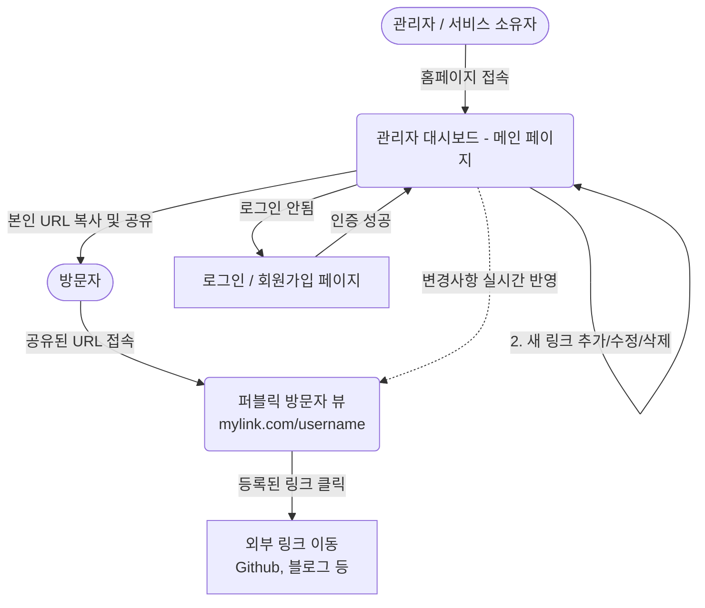

# 마이링크 (Mylink) 와이어프레임

핵심 페이지들의 기본 레이아웃과 구성을 텍스트 기호로 표현한 와이어프레임입니다.

---

## 1. 퍼블릭 방문자 뷰 (Public View)
> **대상 뷰포트**: Mobile 최적화 우선  
> **기능**: 사용자의 링크 모음 렌더링 및 클릭 이벤트 유도

```text
+-------------------------------------------------+
|                                                 |
|                   [프로필 이미지]                    |
|                @username (유저네임)                  |
|            "Display Name (표시 이름)"            |
|            "Bio (한 줄 소개 문구)"               |
|                                                 |
|    [ Github ] [ LinkedIn ] [ Twitter ]          |
|                                                 |
|  +-------------------------------------------+  |
|  | [velog 파비콘] 💻 개인 기술 블로그              |  |
|  +-------------------------------------------+  |
|                                                 |
|  +-------------------------------------------+  |
|  | [github 파비콘] 🚀 오픈소스 사이드 프로젝트       |  |
|  +-------------------------------------------+  |
|                                                 |
|  +-------------------------------------------+  |
|  | [notion 파비콘] 📄 웹 이력서                   |  |
|  +-------------------------------------------+  |
|                                                 |
|            Powered by Mylink                    |
|                                                 |
+-------------------------------------------------+
```

---

## 2. 관리자 대시보드 뷰 (Admin Dashboard)
> **대상 뷰포트**: Desktop / Tablet / Mobile 반응형
> **기능**: 프로필 정보 설정 및 새 링크 생성과 삭제 관리

```text
+---------------------------------------------------------------------------------+
| [Mylink 로고]                                             [내 페이지] [유저프로필] |
+---------------------------------------------------------------------------------+
|                                                                                 |
|  [ 사용자 URL 복사하기: mylink.com/username ]                                       |
|                                                                                 |
|  +-------------------------------------------------------------------------+    |
|  | 프로필 셋업                                                               |    |
|  |  (img) [이미지 업로드]   이름: 개발자_Alex                                  |    |
|  |                        한줄소개: Front-End Developer | React             |    |
|  +-------------------------------------------------------------------------+    |
|                                                                                 |
|  [ + 새 링크 추가하기 ]                                                           |
|                                                                                 |
|                                                                                 |
|  [V] [개인 기술 블로그]                                            [수정][삭제] |    |
|          velog.io/@alex...                                                      |
|                                                                                 |
|  [G] [오픈소스 사이드 프로젝트]                                      [수정][삭제] |    |
|          github.com/...                                                         |
|                                                                                 |
|  [N] [웹 이력서 (Notion)]                                          [수정][삭제] |    |
|                                                                                 |
+---------------------------------------------------------------------------------+
```
*(기호 설명: `[V],[G],[N]`은 파비콘이 그려지는 위치를 의미합니다.)*

---

## 3. 화면 흐름도 (Screen Flow)
> **설명**: 퍼블릭 방문자와 관리자(소유자)의 서비스 이용 흐름도입니다.


```
